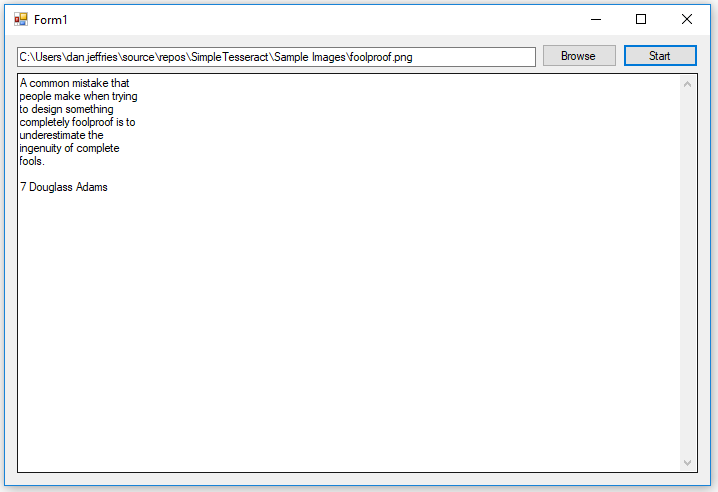

# SimpleTesseract

A simple Windows Forms Application for converting an image to text.

## Getting Started

Install SimpleTesseract from the Setup folder

## Operation

Click Browse to locate the image to convert. Press the start button to convert the image.
There are two test images in the Sample Images folder.

## Screenshot

  

## Built With

* [Visual Studio]( https://visualstudio.microsoft.com/)

## Authors

* **Dan Jeffries** - [dajeffri](https://github.com/dajeffri)

## License

This project is licensed under the MIT License - see the [LICENSE.md](LICENSE) file for details

